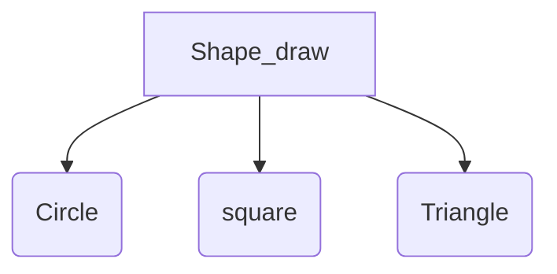
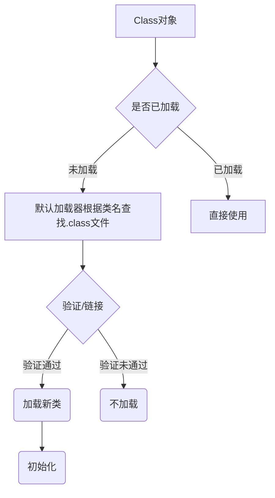

RTTI是运行时类型信息的简写，它使我们可以在运行时发现和使用类型信息。

## 为什么需要RTTI
可能有些人会有疑问，为什么我们需要运行时保存类型信息呢？先来看一个前面经常遇到的例子：`Shape`是所有类的父类，他有一个方法成员`draw()`。因此所有子类都有这个方法。

书中的例子写到，将这三个子类对象放在`List<Shape>`中会向上转型，在这个过程中就会丢失了具体类的属性。通过前面的学习我们已经知道，其实对于`List`来说，他的所有元素都是继承于`Object`类的，仅此而已。因此在运行时（或者说遍历List时），Java就会自动进行类型转换（转换成Shape类型）。
>这就是RTTI的含义：**在运行时，识别一个对象的类型。**


然而这种类型转换其实还不足够，因为我们需要的是更具体的`Circle/Square/Triangle`类。因此假如我们遇到一个特殊的编程问题，需要利用返回引用的确切类型，就能更有效率地解决问题。该怎么办呢？通过RTTI，我们可以在运行时识别将某个Shape引用指向确切的类型。

## Class对象
>学习RTTI光会用肯定是不够的。实际上，在编程的路上，只会如何调用别人的东西，而不清楚原理。那样用的再多，也只是增加用工具的熟练度，不能真正变成自己的“内功”。

讲了点题外话。我们回到正题。因此要理解RTTI肯定要理解类型信息在运行时是怎么表示的。**其实并不复杂，这项工作是由称为`Class对象`的特殊对象完成的，它包含了，与类有关的信息都包含在`Class对象`中。所有的“常规”对象都是由Class对象来创建的。Java就是利用`Class对象`来执行RTTI。即使是类似转型这样的操作**。Class类中含有大量使用RTTI的方式，每当有一个新类被编译都会产生一个新的`Class对象`（换言之就是保存在一个.class的字节码文件中）。
>JVM里生成类对象用的是称为“类加载器”的东西。

这样看上去好像有点绕，虽然我还没读JVM的原理，但是大概可以猜出来，在JVM启动时会启动“类加载器”，首先就加载Class类，一旦有其他类加载进来，JVM会通过“类加载器”读取对应新类的`.class`文件，并将其RTTI（运行时类型信息）放在新的实例`Class对象`中。
>因此，所有的类被第一次使用时，就会动态加载到JVM中，当程序创建了第一个静态成员的引用时，就会加载这个类。（所以构造器也是静态方法。）所以`new`一个新对象会被看作是在加载类。
>因此Java不会一开始就加载所有的类，而是在各个部分必需时才加载。

一个新的Java类加载流程：

>**一旦类被载入内存，所有静态成员都会被创建。**

#### 	API
```Java 
    Class.forName(String)：会加载括号中的同名类，创建所有静态成员。同时forName要放到try块中运行或者定义异常说明，当该类找不到时，会抛出一个`ClassNotFoundException`。
    
    class.newInstance()：利用RTTI创建一个新的对象，只能使用默认的构造器。
```
>注：大写的Class是调用Class类，小写的class是创建后的class对象调用方法。

---

### 类字面常量
其实还有另外一种方式可以生成对`Class`对象的引用，像这样：
>`FancyToy.class`
这样做可以很简单地获取到`class`对象，而且在编译时会对类型进行检查，因此不会在再捕获`ClassNotFoundException`。同时`.class`可以用于许多方面例如*接口、数组、普通数据类型等*。
对于**普通数据类型**，可以用`.TYPE`表示，实际等价于`.class`。

|Element.class|Element.TYPE|
|:-:|:-:|
|int.class|int.TYPE|
|boolean.class|boolean.TYPE|
|....|.....|


##### 与Class.forName()的不同
只有加载是不足以让一个类可以被使用的。Java中为了实用类而要做的准备工作实际包含三个步骤：
>1.加载。由类加载器执行，即寻找字节码，创建一个`Class`对象。
>2.链接。验证类中的字节码，为静态域分配存储空间。
>3.初始化。当类的静态方法（构造器是隐式静态的）被调用或者非常数静态域被首次引用时会进行初始化。初始化的过程：先将超类初始化（如果有的话），然后执行静态的初始化器和静态初始化块。

仅仅利用`.class`生成对`Class`对象的引用时，不会将类初始化。而`Class.forName()`则不同，在调用生成Class引用时，它会立即进行初始化。
假如一个值被修饰为`static final`，那么这个值就是“编译时常量”，就不需要对其所在的类进行初始化也可以被读取。因此当用`.class`生成了一个Class对象的引用，可以直接读取`static final`域。
不过如果只是用`static`或者`final`修饰，就不能保证这种特性了，必须先初始化后才能调用。

### 在编译时对Class引用进行类型检查
在生成Class引用时可以让编译器对Class对象进行检查。例如：
```Java
   Class<Integer> GenericIntClass = int.class;
```
其实这样也可以生成`int.class`的引用
```java
Class intClass=int.class;
```
那为什么要加上泛型`<Integer>`呢？看下面的代码
```java
GenericIntClass = double.class;//编译器直接报错
intClass = double.class;//编译器不会报错
```
这就是问题所在，通过泛型，我们可以实现变量的类型安全。接下来继续看：
```java
Class<?> GenericIntClass = int.class;
GenericIntClass = double.class;//编译器不会报错
```
`<?>`实现了泛型的通配符，表示“任何事物”。通配符的用法还有<? extends father>和<? super child>。
><?> 泛型通配符表示可以放入 "任何事物"。
><? extends father> 表示可以放入任何father类的子类。
><? super child> 表示可放入任何child的超类。

在泛型类中生成具有泛型的`class对象`时，调用该`class`的`newInstance()`方法可以直接获得泛型的类型，而不会只获得一个Object类型。
### instanceof
`instanceof`**关键字可以告诉你这个对象是什么类型的。用了它，我们可以避免产生**`ClassCastException`异常。
例如
```Java
   if(shape instance circle){
        (circle)shape
   }
```
这里描述了对一个shape对象进行是否circle类型的判断。

然而，如果有很多类型，那么传入一个对象是不是就要重复写很多个`instanceof`才能得到我们想要的确切类型呢？
Class.isInstance(Object)能帮到你。

####  Class.isInstance(Object)

例如我们有一个Map，里面装载许多class对象，那么我们可以用这种方式判断出传入的对象的类型。
```Java
    for(Map.Entry<Class<? extends Pet>,Integer>pair : map.entrySet(){
        if(pair.getKey().isInstance(pet){
            //........do something//
        }
    }
```
---

## 反射
通过RTTI，可以获取到某个对象确切的类型。但是有一个限制：这个类型必须在编译时已知，这样才能用RTTI获取到类型信息。那么假如在程序已经运行起来以后，程序通过网络连接等输入方式获取了一串字节码，并且这串字节码代表了一个类，那么该怎么获得这个类的信息呢？
许多语言都提供了运行时获取类的信息的方式，Java也不例外，这种方式叫做反射(reflect)，Java中反射的类库是`java.lang.reflect`，其中包含了三个实现了`Member`接口的类`Field`/`Method`/`Constructor`。
#### API
> invoke()：调用与Method对象关联的方法。
> getFilelds(),getMethods(),getConstructors()用于返回字段、方法、构造器的对象数组。

其实反射并没有什么神奇之处，它所做的就是在运行时加载某个类。而一般加载是在编译时已经完成了。

### 动态代理
代理模式是基本的设计模式，传统的代理模式是静态的，在编译时已经决定好了要代理的对象。*利用反射，可以将代理变成动态代理，编写好代理要进行的代码，然后动态地创建代理。*


#### API

```java
Proxy.newProxyInstance()   :   创建动态代理.需要三个参数：类加载器、该代理实现的接口列表以及InvocationHandler的一个实现。
```
*要理解动态代理为什么要这样做，我们可以先看一下静态代理的实现。*
>静态代理：实体类和代理类实现同一个接口中的方法，在代理构造时传入实体类，代理调用从接口实现的方法从而调用要被代理的方法。
>动态代理：通过Proxy.newProxyInstance()指定要共同实现的接口列表，已经调用代理时要进行的代理操作。动态生成代理类。

那么这个动态的代理是怎么利用反射生成并且调用具体方法的呢？

---

### 接口与RTTI

前面我们已经了解到，接口是多态的一种体现，可以隐藏底层的实现，只暴露上层接口。而有了RTTI，却可以让被当做接口调用的代码调用不存在于接口中的方法，这会使代码耦合程度增加。
虽然我们可以通过设置域来避免这种情况，但是即使你设置成private私有域，依然是可以通过反射调用到的。

# 总结
>RTTI的形式：
>1. 传统的类型转换，如`(shape)parameter`将parameter转型为shape，如果这不是一个正确的类>型转换，就会抛出一个`ClassCastException`。
>2. 查询Class对象获取运行时所需要的信息。
>3.Instanceof可以判断具体对象的实现类。

>反射：
> 和传统类加载方式不同，反射在程序运行时才加载类。一个经典的反射用法就是**动态代理**。